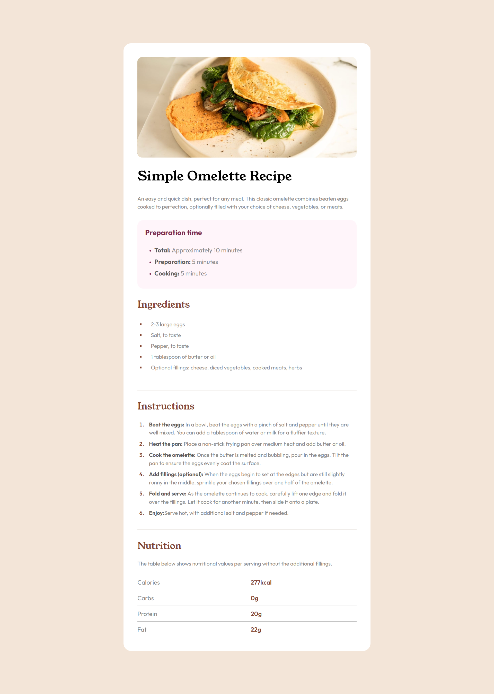
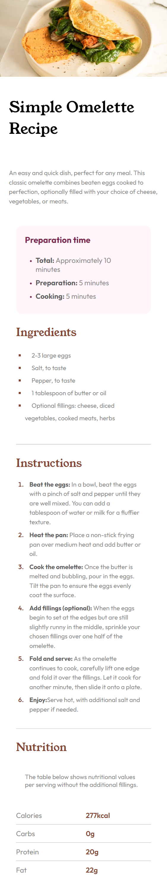

# Frontend Mentor - Recipe page solution

This is a solution to the [Recipe page challenge on Frontend Mentor](https://www.frontendmentor.io/challenges/recipe-page-KiTsR8QQKm). Frontend Mentor challenges help you improve your coding skills by building realistic projects. 

## Table of contents

- [Overview](#overview)
  - [The challenge](#the-challenge)
  - [Screenshot](#screenshot)
  - [Links](#links)
- [My process](#my-process)
  - [Built with](#built-with)
  - [Continued development](#continued-development)
- [Author](#author)
## Overview

### Screenshot
- Desktop
  

- Mobile
  

### Links

- Solution URL: [Repo Link](https://github.com/PranavReddy2703/recipe-page.git)
- Live Site URL: [Website Link](https://pranavreddy2703.github.io/recipe-page/)

## My process

### Built with

- Semantic HTML5 markup
- CSS custom properties
- Flexbox
- CSS Grid
- Mobile-first workflow

### Continued development

In future projects, I’d like to continue improving my skills with responsive design and focus on accessibility, ensuring that my websites are usable by everyone.

## Author

- Frontend Mentor - [@PranavReddy2703](https://www.frontendmentor.io/profile/PranavReddy2703)

